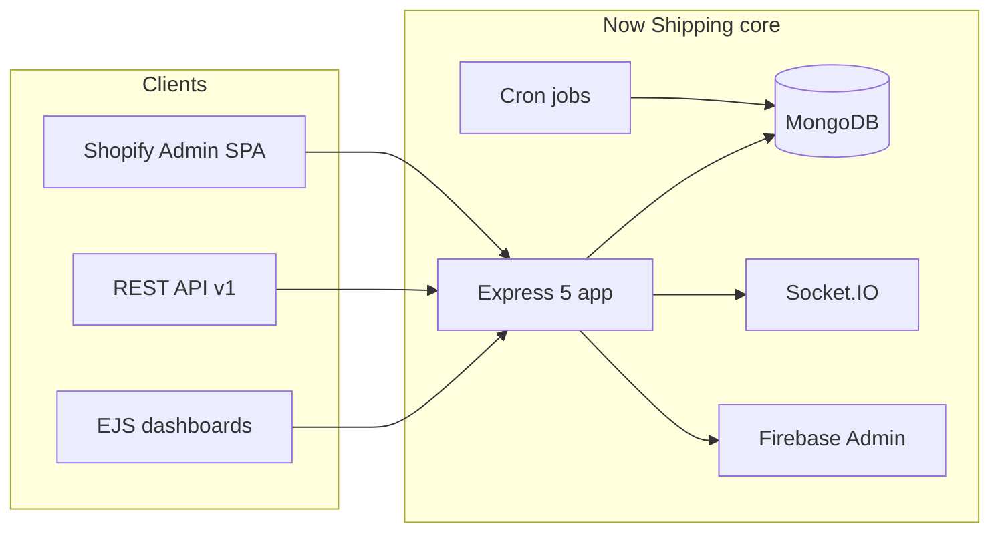

# 01 — Project overview (Now Shipping)

## Publication context (fill before sharing)

Use this block on your portfolio or case study; replace the bracketed fields.

| Field | Your value |
|--------|------------|
| **Employer / client** | _[e.g. Now Shipping product team — in-house / or external client name]_ |
| **Engagement** | _[Start date — End date, or “ongoing”]_ |
| **Outcomes / KPIs (optional)** | _[e.g. on-time delivery %, monthly shipment volume, return SLA — only if accurate and disclosable]_ |

---

## What we built and why

**Product.** Now Shipping ([config/site.js](../config/site.js)) is a logistics operations platform for Egypt: it connects **merchants** with **courier operations** through coordinated workflows—order intake (including e‑commerce sync), assignment and delivery progression, financial visibility (wallet/payout-related flows per codebase jobs), **returns lifecycle** ([README.md](../README.md)), and stakeholder dashboards.

**Client / context.** Public-facing identity is **Now Shipping** (Cairo, Egypt; contact and social links centralized in [config/site.js](../config/site.js)). Frame this either as **product work for the operating company** or as **client delivery**—swap in your employer or client name using the table above.

**Goals (evidence-aligned).**

- **Operational control:** Separate web surfaces for **admin**, **business**, **courier**, and **manage** routes ([app.js](../app.js) layout and route mounting), each with role-appropriate workflows.
- **Scale of channels:** **REST API v1** for mobile (`/api/v1/auth`, `business`, `courier`, `assistant`, `tickets`, `upload`) plus web — same backend, multiple clients ([app.js](../app.js)).
- **Commerce integration:** **Shopify** — OAuth callback, Admin **embedded SPA** under `/shopify-app`, **HMAC-verified webhooks** with raw JSON body ([app.js](../app.js)), sync retry job (`initShopifySyncRetry` in [app.js](../app.js)).
- **Real-time and notifications:** **Socket.IO** for live updates ([app.js](../app.js)); **Firebase Admin** for push ([app.js](../app.js) `require('./config/firebase')`, usage across controllers).
- **Locale:** **Arabic + English** via `i18n-express` ([app.js](../app.js)) and [i18n/en.json](../i18n/en.json) marketing copy — matches Egypt market needs.

### One paragraph you can paste

> We delivered **Now Shipping**, a multi-sided logistics platform that lets Egyptian businesses run deliveries end-to-end: merchants operate from a business dashboard, operations staff use admin/manage tooling, couriers execute field work (web + mobile API), and customers/stakeholders receive timely status updates. The product aimed to replace ad-hoc coordination with **a single system of record** for orders, logistics events, money movement (wallet/payout flows), and **returns**, while integrating **Shopify** for automated order sync and embedding key workflows inside the merchant’s existing commerce stack.

---

## The challenge

**Problem.** Last-mile and domestic logistics in Egypt often depends on **manual handoffs** (chat, spreadsheets, disconnected courier tools). That creates **delivery delays, opaque financials, disputes on returns/refunds**, and **no unified audit trail** when something goes wrong.

**What we had to solve in software**

- **Multi-role truth:** Same shipment seen consistently by business, ops, and courier; status transitions must be enforceable and traceable (controllers + models pattern implied by multi-route architecture).
- **External dependencies:** **Carrier/domain data** (e.g. Bosta-oriented region tooling in [scripts/merge-cairo-bosta-ar-labels.js](../scripts/merge-cairo-bosta-ar-labels.js)) and **Shopify** require resilient sync (**retry job**), webhook security (raw body + HMAC path in [app.js](../app.js)), and careful upload/body-parser composition (documented `shouldSkipExpressFileUpload` in [app.js](../app.js)).
- **Money and trust:** **Payout processing** runs on a schedule (`initPayoutProcessing` in [app.js](../app.js)) — correctness and idempotency matter as much as UX.
- **Returns complexity:** [README.md](../README.md) describes **business-initiated returns**, **failed-delivery auto-returns**, admin approval, courier pickup, warehouse processing, refunds — a **state machine** problem, not a single “cancel order” button.
- **Mobile + CDN edge cases:** API responses set `Cache-Control: private, no-transform` for `/api/v1` to avoid CDN transforms breaking mobile JSON parsing ([app.js](../app.js) comment re Brotli/gzip) — real-world constraint for Egyptian mobile networks and intermediaries.

**Constraints (honest portfolio framing)**

- **Monolith-first delivery:** One **Express 5** app serves EJS dashboards, APIs, Shopify routes, and static assets — fast iteration, one deploy surface; requires discipline around routes and middleware order ([app.js](../app.js)).
- **Security surface:** Sessions for web, JWT errors handled globally ([app.js](../app.js)), Shopify secrets and encrypted token storage ([models/shopifyInstallation.js](../models/shopifyInstallation.js) references token crypto in codebase).
- **Ops:** **node-cron** jobs for payouts and Shopify retry ([package.json](../package.json), [app.js](../app.js)); **Node ≥ 18** ([package.json](../package.json)).

---

## Tech stack and selection rationale

| Layer | Choice | Why it fits this product |
|--------|--------|---------------------------|
| Runtime | **Node.js (≥18)** | One language for APIs, jobs, PDF/image tooling, Shopify server-side; Web Crypto polyfill note in [app.js](../app.js) shows attention to library expectations. |
| Web framework | **Express 5** | Mature routing for many prefixes (`/admin`, `/business`, `/courier`, `/api/v1`, Shopify); Express 5 path rules noted in comments ([app.js](../app.js)). |
| Data | **MongoDB + Mongoose** | Flexible schema for orders, returns, multi-role entities, and integration payloads; connection gates server boot ([app.js](../app.js)). |
| Server-rendered UI | **EJS + express-ejs-layouts** | Role-specific layouts for admin/courier/business ([app.js](../app.js)) — rapid iteration for internal/operator dashboards. |
| Real-time | **Socket.IO** | Live operational updates ([app.js](../app.js)). |
| Push | **Firebase Admin** | Cross-platform notifications tied to order/courier events (imports in controllers). |
| Mobile API | **REST + JWT** (`jsonwebtoken` in [package.json](../package.json)) | Thin clients; separation from web session auth. |
| Commerce | **@shopify/shopify-api**, embedded **Vite** SPA under `public/shopify-app` | Native merchant workflow inside Shopify Admin; webhooks for inventory/order sync. |
| i18n | **i18n-express** | AR/EN for market reach ([app.js](../app.js)). |
| Documents / ops | **pdf-lib**, **pdfkit**, **puppeteer**, **exceljs**, **qrcode**, **bwip-js** | Labels, exports, scanning workflows typical of logistics. |
| Background work | **node-cron** | Payouts and sync retries without a separate worker service (pragmatic for current scale). |
| Email | **nodemailer** | Transactional comms for a logistics product. |
| Translation | **Google Cloud Translate + vitalets fallback** ([package.json](../package.json)) | Bilingual content and operational copy at scale. |

### Selection narrative (one short paragraph)

> We chose a **Node/Express monolith with MongoDB** to ship a **unified logistics domain model** quickly across web and mobile, while using **Shopify’s official API** and **Firebase** where ecosystem standards matter. **EJS** kept operator dashboards maintainable; **Socket.IO** and **FCM** covered real-time and push without forcing merchants onto the web app for every update. **Scheduled jobs** handled payout and integration reliability so human operations were not the backup cron.

---

## Architecture diagram (optional)

---

## Pre-publish verification checklist

Complete this before publishing externally (addresses carrier naming, metrics, and NDAs).

- [ ] **Carrier and partner names:** Only name carriers (e.g. Bosta) in public copy if integration is accurate **and** your agreement allows it.
- [ ] **Metrics and volumes:** Every KPI or percentage is **verified** and **approved** for disclosure (no placeholder business numbers).
- [ ] **Client vs product:** Employer or client name and dates in **Publication context** match how you represent the engagement.
- [ ] **Shopify / Firebase:** No secrets, tokens, or internal URLs appear in the published document.

---

## Customisation reminders

- Replace bracketed fields in **Publication context** with real employer/client name, dates, and optional KPIs.
- Name third-party logistics providers only when accurate and permitted.
