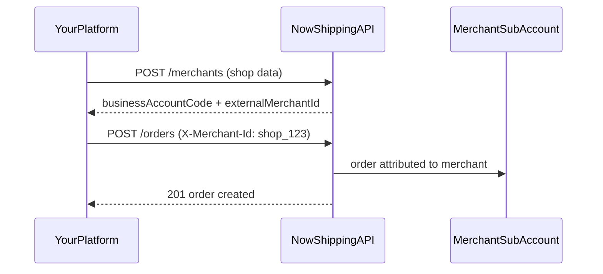

# Now Shipping Public API v1 — Integration Guide

**Version:** 1.0  
**Last updated:** July 2026  
**Audience:** Engineering teams building integrations with Now Shipping  
**Base URL:** `https://your-domain.com/api/public/v1`

---

## Table of contents

1. [Introduction](#1-introduction)
2. [Concepts and glossary](#2-concepts-and-glossary)
3. [Getting started](#3-getting-started)
4. [Authentication](#4-authentication)
5. [API key scopes](#5-api-key-scopes)
6. [Multi-tenant model (company integrators)](#6-multi-tenant-model-company-integrators)
7. [Request and response format](#7-request-and-response-format)
8. [Rate limiting](#8-rate-limiting)
9. [Quickstart workflows](#9-quickstart-workflows)
10. [System endpoints](#10-system-endpoints)
11. [Merchants API](#11-merchants-api)
12. [Delivery zones](#12-delivery-zones)
13. [Fees API](#13-fees-api)
14. [Orders API](#14-orders-api)
15. [Pickups API](#15-pickups-api)
16. [Error reference](#16-error-reference)
17. [End-to-end worked example](#17-end-to-end-worked-example)
18. [Best practices and checklist](#18-best-practices-and-checklist)
19. [Support and changelog](#19-support-and-changelog)

---

## 1. Introduction

The Now Shipping Public API v1 is a REST API that lets external systems:

- Onboard merchant sub-accounts (multi-tenant platforms)
- Create, update, cancel, and delete shipping orders
- Download AWB (shipping label) PDFs
- Schedule and manage pickups
- Preview shipping and pickup fees
- Retrieve the delivery zone catalog

**Key principles:**

- Fees are **always computed server-side** — never send `orderFees`, `fee`, `shippingFee`, `pickupFees`, or similar fields in requests.
- Zones must be **exact values** from `GET /delivery-zones` — free text like `"Nasr City"` is rejected.
- API keys are issued by Now Shipping admin and shown **once** at creation.

**Interactive documentation:**

| Resource | URL |
|----------|-----|
| Redoc UI | `GET /api/public/v1/docs` |
| OpenAPI spec | `GET /api/public/v1/openapi.yaml` |

---

## 2. Concepts and glossary

| Term | Description |
|------|-------------|
| **Business account** | A Now Shipping merchant account (role: `Business`). |
| **Company account** | A special business account flagged as `isCompanyAccount = true`. Represents a multi-tenant integrator platform (e.g. an e-commerce SaaS). |
| **Merchant sub-account** | A business account linked to a company via `parentCompany`. Each shop on your platform maps to one merchant sub-account. |
| **API key** | Secret token (`nsk_live_...`) authenticating your integration. One key can serve all merchants under a company account. |
| **businessAccountCode** | 8-digit code auto-assigned to every business (e.g. `48291736`). Primary merchant identifier for `X-Merchant-Id`. |
| **externalMerchantId** | Your platform's own shop ID (e.g. `shop_123`), stored at onboarding. Also accepted as `X-Merchant-Id`. |
| **X-Merchant-Id** | Per-request header identifying which merchant an order/pickup belongs to (company keys only). |
| **Scope** | Permission attached to an API key: `orders`, `pickups`, `merchants`. |
| **AWB** | Air Waybill — the printable shipping label PDF for an order. |
| **Zone catalog** | Authoritative list of governorate + zone values from `GET /delivery-zones`. |

---

## 3. Getting started

### Prerequisites (admin setup — one time)

1. Now Shipping admin marks your account as **Company account** (for multi-tenant integrators).
2. Admin creates an API key under **Admin → Business details → API Access**.
3. Copy and securely store the full key (`nsk_live_...`) — it is shown **once**.

### Headers used in every request

```http
Authorization: Bearer nsk_live_YOUR_KEY
Content-Type: application/json
```

For company keys on order/pickup routes, also send:

```http
X-Merchant-Id: 48291736
```

Alternative auth header:

```http
X-Api-Key: nsk_live_YOUR_KEY
```

---

## 4. Authentication

All endpoints except `/docs` and `/openapi.yaml` require a valid API key.

### How keys work

- Format: `nsk_live_<random_string>`
- Only a SHA-256 hash is stored in the database; the raw key cannot be recovered.
- Revoked keys return `401 UNAUTHORIZED`.
- Deleted business accounts return `403 ACCOUNT_REMOVED`.

### Verify your key

```bash
curl "https://your-domain.com/api/public/v1/ping" \
  -H "Authorization: Bearer nsk_live_YOUR_KEY"
```

**Response `200`:**

```json
{
  "success": true,
  "data": {
    "message": "Now Shipping Public API v1",
    "account": {
      "id": "66e0a1b2c3d4e5f6a7b8c9d0",
      "name": "My Platform",
      "brandName": "My Platform",
      "businessAccountCode": "12345678",
      "isCompanyAccount": true
    },
    "scopes": ["orders", "pickups", "merchants"],
    "keyPrefix": "nsk_live"
  }
}
```

When `X-Merchant-Id` is included, `activeMerchant` is also returned.

---

## 5. API key scopes

Each API key has scopes controlling which endpoint groups it can access.

| Scope | Endpoints |
|-------|-----------|
| `orders` | `/orders/*` |
| `pickups` | `/pickups/*` |
| `merchants` | `/merchants/*` |

**No scope required:** `/ping`, `/delivery-zones`, `/fees/calculate`, `/docs`, `/openapi.yaml`

New tokens default to: `["orders", "pickups", "merchants"]`

**Backward compatibility:** Existing keys with only `orders` + `pickups` can still access `/merchants` endpoints.

Missing scope returns `403 SCOPE_DENIED`.

---

## 6. Multi-tenant model (company integrators)

### Architecture



### Rules

| Account type | X-Merchant-Id | Behavior |
|--------------|---------------|----------|
| Single business | Not required | Key operates on that business directly |
| Company account | **Required** on orders/pickups | Resolves merchant sub-account per request |
| Company account | Optional on `/fees/calculate` | Uses company pricing if omitted; merchant pricing if set |

### X-Merchant-Id accepted values

| Value | Example |
|-------|---------|
| `businessAccountCode` | `48291736` |
| `externalMerchantId` | `shop_123` |
| MongoDB `_id` | `66f1a2b3c4d5e6f7a8b9c0d1` |

Also accepted as query param: `?merchantId=48291736`

---

## 7. Request and response format

### Success

```json
{
  "success": true,
  "data": { }
}
```

List endpoints may include pagination inside `data`:

```json
{
  "success": true,
  "data": {
    "orders": [],
    "pagination": {
      "currentPage": 1,
      "totalPages": 5,
      "totalCount": 100,
      "hasNext": true,
      "hasPrev": false
    }
  }
}
```

### Error

```json
{
  "success": false,
  "error": {
    "code": "VALIDATION_ERROR",
    "message": "Human-readable description",
    "details": { }
  }
}
```

`details` is optional (e.g. `currentStatus` on cancel failures).

---

## 8. Rate limiting

- **Limit:** 120 requests per minute per API key
- **Response when exceeded:** `429 RATE_LIMITED`
- Implement exponential backoff on `429` responses

---

## 9. Quickstart workflows

### Single business

1. `GET /delivery-zones` — load zone picker
2. `POST /fees/calculate` — preview fee (optional)
3. `POST /orders` — create order
4. `GET /orders/{orderNumber}/awb` — download label
5. `POST /pickups` — schedule pickup

### Company integrator (multi-tenant)

1. `GET /delivery-zones` — load zone picker (cache with ETag)
2. `POST /merchants` — onboard each shop (one API call per merchant)
3. Store `businessAccountCode` and/or `externalMerchantId` in your database
4. `POST /fees/calculate` + `X-Merchant-Id` — preview fee (optional)
5. `POST /orders` + `X-Merchant-Id` — create order
6. `GET /orders/{orderNumber}/awb` + `X-Merchant-Id` — download label
7. `POST /pickups` + `X-Merchant-Id` — schedule pickup

---

## 10. System endpoints

### GET /ping

Health check and identity verification.

| | |
|---|---|
| **Auth** | API key |
| **Scope** | None |

```bash
curl "https://your-domain.com/api/public/v1/ping" \
  -H "Authorization: Bearer nsk_live_YOUR_KEY"
```

---

## 11. Merchants API

**Company API keys only.** Scope: `merchants` (or `orders` + `pickups` for backward compat).

Merchants created via API are **ready to ship immediately** (`isVerified: true`, `isCompleted: true`, default pickup address). They do **not** receive dashboard login credentials.

### POST /merchants — Onboard a merchant

| | |
|---|---|
| **Auth** | API key |
| **Scope** | `merchants` |
| **Content-Type** | `application/json` |

#### Request body

| Field | Type | Required | Description |
|-------|------|----------|-------------|
| `name` | string | yes | Merchant owner or business name |
| `email` | string | yes | Contact email (globally unique) |
| `phone` | string | yes | 11-digit Egyptian mobile (e.g. `01012345678`) |
| `brandName` | string | yes | Public brand name |
| `externalMerchantId` | string | no | Your platform shop ID (unique per company) |
| `pickupAddress` | object | yes | Default pickup address |
| `pickupAddress.city` | string | yes | Governorate: `Cairo`, `Giza`, or `Qalyubia` |
| `pickupAddress.zone` | string | yes | Exact zone `value` from `GET /delivery-zones` |
| `pickupAddress.addressDetails` | string | yes | Street, building, floor |
| `pickupAddress.pickupPhone` | string | yes | 11-digit contact phone |
| `pickupAddress.nearbyLandmark` | string | no | Landmark for courier |
| `pickupAddress.country` | string | no | Defaults to `Egypt` |

#### Example

```bash
curl -X POST "https://your-domain.com/api/public/v1/merchants" \
  -H "Authorization: Bearer nsk_live_YOUR_KEY" \
  -H "Content-Type: application/json" \
  -d '{
    "name": "Acme Store",
    "email": "owner@acme.com",
    "phone": "01000000000",
    "brandName": "Acme",
    "externalMerchantId": "shop_123",
    "pickupAddress": {
      "city": "Cairo",
      "zone": "Nasr City - ElHay 06 (Nasr City)",
      "addressDetails": "12 Street, Building 4",
      "pickupPhone": "01000000000",
      "nearbyLandmark": "Near City Center"
    }
  }'
```

#### Response `201`

```json
{
  "success": true,
  "data": {
    "message": "Merchant onboarded successfully.",
    "merchant": {
      "id": "66f1a2b3c4d5e6f7a8b9c0d1",
      "businessAccountCode": "48291736",
      "name": "Acme Store",
      "brandName": "Acme",
      "email": "owner@acme.com",
      "phoneNumber": "01000000000",
      "externalMerchantId": "shop_123",
      "isCompleted": true,
      "isVerified": true,
      "parentCompany": "66e0a1b2c3d4e5f6a7b8c9d0",
      "createdAt": "2026-07-26T15:00:00.000Z"
    }
  }
}
```

#### Merchant object fields

| Field | Type | Description |
|-------|------|-------------|
| `id` | string | MongoDB `_id` |
| `businessAccountCode` | string | 8-digit code — use as `X-Merchant-Id` |
| `name` | string | Merchant name |
| `brandName` | string | Brand name |
| `email` | string | Contact email |
| `phoneNumber` | string | Contact phone |
| `externalMerchantId` | string | Your shop ID (if provided) |
| `isCompleted` | boolean | Profile complete |
| `isVerified` | boolean | Account verified |
| `parentCompany` | string | Company account `_id` |
| `createdAt` | string | ISO 8601 timestamp |

---

### GET /merchants — List merchants

| | |
|---|---|
| **Auth** | API key |
| **Scope** | `merchants` |

#### Query parameters

| Param | Type | Default | Description |
|-------|------|---------|-------------|
| `page` | integer | `1` | Page number |
| `limit` | integer | `50` | Results per page |
| `search` | string | — | Search name, email, phone, businessAccountCode, externalMerchantId, brandName |

```bash
curl "https://your-domain.com/api/public/v1/merchants?page=1&limit=20&search=acme" \
  -H "Authorization: Bearer nsk_live_YOUR_KEY"
```

#### Response `200`

```json
{
  "success": true,
  "data": {
    "merchants": [ { "id": "...", "businessAccountCode": "48291736", "name": "Acme Store" } ],
    "pagination": {
      "currentPage": 1,
      "totalPages": 1,
      "totalCount": 1,
      "hasNext": false,
      "hasPrev": false
    }
  }
}
```

---

### GET /merchants/{merchantId} — Get merchant

| | |
|---|---|
| **Auth** | API key |
| **Scope** | `merchants` |

`merchantId` accepts `businessAccountCode`, `externalMerchantId`, or MongoDB `_id`.

```bash
curl "https://your-domain.com/api/public/v1/merchants/shop_123" \
  -H "Authorization: Bearer nsk_live_YOUR_KEY"
```

#### Response `200`

```json
{
  "success": true,
  "data": {
    "merchant": {
      "id": "66f1a2b3c4d5e6f7a8b9c0d1",
      "businessAccountCode": "48291736",
      "name": "Acme Store",
      "brandName": "Acme",
      "email": "owner@acme.com",
      "phoneNumber": "01000000000",
      "externalMerchantId": "shop_123",
      "isCompleted": true,
      "isVerified": true,
      "parentCompany": "66e0a1b2c3d4e5f6a7b8c9d0",
      "createdAt": "2026-07-26T15:00:00.000Z"
    }
  }
}
```

---

## 12. Delivery zones

### GET /delivery-zones

Returns the authoritative catalog of governorates and zones. **Always use exact `value` strings** from this response in order create/update and merchant onboarding.

| | |
|---|---|
| **Auth** | API key |
| **Scope** | None |
| **Caching** | Supports `ETag` / `If-None-Match` (`304 Not Modified`) |

```bash
curl "https://your-domain.com/api/public/v1/delivery-zones" \
  -H "Authorization: Bearer nsk_live_YOUR_KEY"
```

#### Response structure

```json
{
  "success": true,
  "data": {
    "meta": {
      "schemaVersion": 1,
      "governorateKeys": ["Cairo", "Giza", "Qalyubia"]
    },
    "governorates": [
      {
        "key": "Cairo",
        "value": "Cairo",
        "label": { "en": "Cairo", "ar": "القاهرة" },
        "areas": [
          {
            "value": "Nasr City - ElHay 06 (Nasr City)",
            "label": { "en": "Nasr City - ElHay 06 (Nasr City)", "ar": "..." }
          }
        ]
      }
    ]
  }
}
```

**Governorates:** `Cairo`, `Giza`, `Qalyubia`

**Zone rule:** Use `areas[].value` exactly — not abbreviations or Arabic-only labels.

---

## 13. Fees API

Fees are computed server-side. **Never send fee values in create/update requests.**

### POST /fees/calculate — Preview order shipping fee

| | |
|---|---|
| **Auth** | API key |
| **Scope** | None |
| **X-Merchant-Id** | Optional (uses merchant custom pricing if set) |

#### Request body

| Field | Type | Required | Description |
|-------|------|----------|-------------|
| `government` | string | yes | `Cairo`, `Giza`, or `Qalyubia` |
| `orderType` | string | yes | `Deliver`, `Return`, or `Exchange` |
| `isExpressShipping` | boolean | no | Fast delivery (Deliver only). Default `false` |

```bash
curl -X POST "https://your-domain.com/api/public/v1/fees/calculate" \
  -H "Authorization: Bearer nsk_live_YOUR_KEY" \
  -H "X-Merchant-Id: shop_123" \
  -H "Content-Type: application/json" \
  -d '{
    "government": "Cairo",
    "orderType": "Deliver",
    "isExpressShipping": false
  }'
```

#### Response `200`

```json
{
  "success": true,
  "data": {
    "fee": 120,
    "currency": "EGP",
    "note": "Fees are computed by Now Shipping based on zone, order type, and express shipping. Never send fee values when creating orders."
  }
}
```

Fee factors: governorate, order type, express flag, and business custom pricing (if enabled by admin).

---

## 14. Orders API

Scope: `orders`. Company keys require `X-Merchant-Id`.

Fees in responses are authoritative. Ignored if sent in request body: `orderFees`, `fee`, `shippingFee`, `amountOfFees`.

### POST /orders — Create order

| | |
|---|---|
| **Auth** | API key |
| **Scope** | `orders` |
| **X-Merchant-Id** | Required for company keys |

#### Request body — common fields

| Field | Type | Required | Description |
|-------|------|----------|-------------|
| `fullName` | string | yes | Customer name |
| `phoneNumber` | string | yes | Customer phone |
| `otherPhoneNumber` | string | no | Secondary phone |
| `address` | string | yes | Street address |
| `buildingNo` | string | no | Building number |
| `apartmentNo` | string | no | Apartment number |
| `government` | string | yes | `Cairo`, `Giza`, or `Qalyubia` |
| `zone` | string | yes | Exact zone from `/delivery-zones` catalog |
| `deliverToWorkAddress` | boolean | no | Deliver to work address |
| `orderType` | string | yes | `Deliver`, `Return`, or `Exchange` |
| `previewPermission` | boolean | no | Allow customer preview |
| `referralNumber` | string | no | Your external reference / order ID |
| `Notes` | string | no | Order notes |
| `selectedPickupAddressId` | string | no | Merchant pickup address ID (auto-defaults to main address) |

#### Deliver-specific fields

| Field | Type | Required | Description |
|-------|------|----------|-------------|
| `productDescription` | string | yes | Product description |
| `numberOfItems` | number | yes | Item count (positive) |
| `isExpressShipping` | boolean | no | Fast delivery |
| `COD` | boolean | no | Cash on delivery |
| `amountCOD` | number | no | COD amount (EGP) |

#### Return-specific fields

| Field | Type | Required | Description |
|-------|------|----------|-------------|
| `productDescription` | string | yes | Product description |
| `numberOfItems` | number | yes | Item count |
| `originalOrderNumber` | string | yes | Completed deliver order to return |
| `returnReason` | string | yes | Reason for return |
| `returnNotes` | string | no | Additional return notes |
| `isPartialReturn` | boolean | no | Partial return flag |
| `partialReturnItemCount` | number | if partial | Items being returned |
| `originalOrderItemCount` | number | no | Original order item count |

#### Exchange-specific fields

| Field | Type | Required | Description |
|-------|------|----------|-------------|
| `currentPD` | string | yes | Current product description |
| `numberOfItemsCurrentPD` | number | yes | Current item count |
| `newPD` | string | yes | Replacement product description |
| `numberOfItemsNewPD` | number | yes | Replacement item count |
| `CashDifference` | boolean | no | Cash difference |
| `amountCashDifference` | number | no | CD amount (EGP) |

#### Example — Deliver order

```bash
curl -X POST "https://your-domain.com/api/public/v1/orders" \
  -H "Authorization: Bearer nsk_live_YOUR_KEY" \
  -H "X-Merchant-Id: shop_123" \
  -H "Content-Type: application/json" \
  -d '{
    "fullName": "Ahmed Hassan",
    "phoneNumber": "01012345678",
    "address": "15 Nile Street",
    "government": "Cairo",
    "zone": "Nasr City - ElHay 06 (Nasr City)",
    "orderType": "Deliver",
    "productDescription": "T-shirt x2",
    "numberOfItems": 2,
    "isExpressShipping": false,
    "COD": true,
    "amountCOD": 500,
    "referralNumber": "ORDER-1001"
  }'
```

#### Response `201` — order summary object

| Field | Type | Description |
|-------|------|-------------|
| `orderId` | string | MongoDB `_id` |
| `orderNumber` | string | 6-digit display number |
| `orderStatus` | string | Current status (e.g. `new`) |
| `statusCategory` | string | Status category |
| `orderFees` | number | Server-computed fee (EGP) |
| `orderDate` | string | Order date |
| `orderType` | string | `Deliver`, `Return`, `Exchange` |
| `isExpressShipping` | boolean | Express flag |
| `amountType` | string | `COD`, `CD`, or `NA` |
| `amount` | number | COD/CD amount |
| `customer.fullName` | string | Customer name |
| `customer.phoneNumber` | string | Customer phone |
| `customer.government` | string | Governorate |
| `customer.zone` | string | Zone |
| `productDescription` | string | Product description |
| `numberOfItems` | number | Item count |

```json
{
  "success": true,
  "data": {
    "message": "Order created successfully.",
    "order": {
      "orderId": "66f1a2b3c4d5e6f7a8b9c0d2",
      "orderNumber": "482917",
      "orderStatus": "new",
      "statusCategory": "new",
      "orderFees": 120,
      "orderDate": "2026-07-26T12:00:00.000Z",
      "orderType": "Deliver",
      "isExpressShipping": false,
      "amountType": "COD",
      "amount": 500,
      "customer": {
        "fullName": "Ahmed Hassan",
        "phoneNumber": "01012345678",
        "government": "Cairo",
        "zone": "Nasr City - ElHay 06 (Nasr City)"
      },
      "productDescription": "T-shirt x2",
      "numberOfItems": 2
    }
  }
}
```

---

### GET /orders — List orders

| | |
|---|---|
| **Auth** | API key |
| **Scope** | `orders` |
| **X-Merchant-Id** | Required for company keys |

#### Query parameters

| Param | Type | Default | Description |
|-------|------|---------|-------------|
| `page` | integer | `1` | Page number |
| `limit` | integer | `50` | Results per page |
| `orderType` | string | — | `Deliver`, `Return`, `Exchange`, or `All` |
| `status` | string | — | Order status filter |
| `statusCategory` | string | — | Status category filter |
| `paymentType` | string | — | `COD`, `CD`, `NA`, or `All` |
| `dateFrom` | string | — | ISO date filter (start) |
| `dateTo` | string | — | ISO date filter (end) |
| `search` | string | — | Search order number, customer name/phone, product |

```bash
curl "https://your-domain.com/api/public/v1/orders?page=1&limit=20&status=new" \
  -H "Authorization: Bearer nsk_live_YOUR_KEY" \
  -H "X-Merchant-Id: shop_123"
```

---

### GET /orders/{orderNumber} — Get order details

Returns full order object including status labels, tracking stages, and business pickup addresses.

```bash
curl "https://your-domain.com/api/public/v1/orders/482917" \
  -H "Authorization: Bearer nsk_live_YOUR_KEY" \
  -H "X-Merchant-Id: shop_123"
```

---

### PUT /orders/{orderId} — Update order

| | |
|---|---|
| **Path param** | `orderId` — MongoDB `_id` or `orderNumber` |
| **Editable** | Only while order is in an editable status (typically before courier assignment) |
| **Fees** | Recalculated automatically from government + orderType + express |

Send the same body fields as create. Zone validation applies.

```bash
curl -X PUT "https://your-domain.com/api/public/v1/orders/482917" \
  -H "Authorization: Bearer nsk_live_YOUR_KEY" \
  -H "X-Merchant-Id: shop_123" \
  -H "Content-Type: application/json" \
  -d '{
    "fullName": "Ahmed Hassan",
    "phoneNumber": "01012345678",
    "address": "20 Nile Street",
    "government": "Cairo",
    "zone": "Nasr City - ElHay 06 (Nasr City)",
    "orderType": "Deliver",
    "productDescription": "T-shirt x2",
    "numberOfItems": 2,
    "isExpressShipping": false
  }'
```

**Restrictions:**
- Express shipping cannot be changed for orders older than 6 hours.
- Address/details cannot be edited after courier assignment or past editable stage.

---

### POST /orders/{orderId}/cancel — Cancel order

```bash
curl -X POST "https://your-domain.com/api/public/v1/orders/482917/cancel" \
  -H "Authorization: Bearer nsk_live_YOUR_KEY" \
  -H "X-Merchant-Id: shop_123"
```

Cancellation rules depend on current order status.

---

### DELETE /orders/{orderId} — Delete order

Only orders with status `new` can be deleted.

```bash
curl -X DELETE "https://your-domain.com/api/public/v1/orders/482917" \
  -H "Authorization: Bearer nsk_live_YOUR_KEY" \
  -H "X-Merchant-Id: shop_123"
```

---

### GET /orders/{orderNumber}/awb — Download AWB (shipping label PDF)

| | |
|---|---|
| **Response** | `application/pdf` (binary) |
| **Query** | `size` — `A4` (default) or `A5` |

```bash
curl "https://your-domain.com/api/public/v1/orders/482917/awb?size=A4" \
  -H "Authorization: Bearer nsk_live_YOUR_KEY" \
  -H "X-Merchant-Id: shop_123" \
  -o awb-482917.pdf
```

---

## 15. Pickups API

Scope: `pickups`. Company keys require `X-Merchant-Id`.

Pickup fees are server-computed. Ignored if sent: `pickupFees`, `fee`, `amountOfFees`.

### POST /pickups/calculate-fee — Preview pickup fee

| | |
|---|---|
| **Auth** | API key |
| **Scope** | `pickups` |
| **X-Merchant-Id** | Required for company keys |

#### Request body

| Field | Type | Required | Description |
|-------|------|----------|-------------|
| `numberOfOrders` | number | no | Expected order count (affects fee) |
| `pickupAddressId` | string | no | Merchant pickup address ID |

```bash
curl -X POST "https://your-domain.com/api/public/v1/pickups/calculate-fee" \
  -H "Authorization: Bearer nsk_live_YOUR_KEY" \
  -H "X-Merchant-Id: shop_123" \
  -H "Content-Type: application/json" \
  -d '{ "numberOfOrders": 10 }'
```

#### Response `200`

```json
{
  "success": true,
  "data": {
    "fee": 50,
    "currency": "EGP",
    "note": "Pickup fees are computed by Now Shipping. Never send pickupFees in create/update requests."
  }
}
```

---

### POST /pickups — Create pickup

| | |
|---|---|
| **Auth** | API key |
| **Scope** | `pickups` |
| **X-Merchant-Id** | Required for company keys |

#### Request body

| Field | Type | Required | Description |
|-------|------|----------|-------------|
| `numberOfOrders` | number | yes | Expected order count |
| `pickupDate` | string | yes | Scheduled date (`YYYY-MM-DD`) — must be valid per pickup date policy |
| `phoneNumber` | string | yes | Contact phone |
| `isFragileItems` | boolean | no | Fragile items flag |
| `isLargeItems` | boolean | no | Large items flag |
| `pickupNotes` | string | no | Notes for courier |
| `pickupLocation` | string | no | Override location text |
| `pickupAddressId` | string | no | Merchant pickup address ID (defaults to main address) |

```bash
curl -X POST "https://your-domain.com/api/public/v1/pickups" \
  -H "Authorization: Bearer nsk_live_YOUR_KEY" \
  -H "X-Merchant-Id: shop_123" \
  -H "Content-Type: application/json" \
  -d '{
    "numberOfOrders": 15,
    "pickupDate": "2026-07-28",
    "phoneNumber": "01012345678",
    "isFragileItems": false,
    "isLargeItems": false,
    "pickupNotes": "Call before arrival"
  }'
```

#### Response `201` — pickup summary object

| Field | Type | Description |
|-------|------|-------------|
| `pickupId` | string | MongoDB `_id` |
| `pickupNumber` | string | 6-digit pickup number |
| `pickupDate` | string | Scheduled date |
| `picikupStatus` | string | Status (e.g. `new`) |
| `statusCategory` | string | Category |
| `statusLabel` | string | Human-readable status |
| `numberOfOrders` | number | Expected orders |
| `pickupFees` | number | Server-computed fee (EGP) |
| `phoneNumber` | string | Contact phone |
| `pickupLocation` | string | Location text |
| `pickupAddressId` | string | Linked address ID |
| `isFragileItems` | boolean | Fragile flag |
| `isLargeItems` | boolean | Large items flag |
| `pickupNotes` | string | Notes |
| `createdAt` | string | ISO timestamp |
| `updatedAt` | string | ISO timestamp |

---

### GET /pickups — List pickups

#### Query parameters

| Param | Type | Default | Description |
|-------|------|---------|-------------|
| `page` | integer | `1` | Page number |
| `limit` | integer | `30` | Results per page |
| `status` | string | — | Pickup status filter |
| `statusCategory` | string | — | Category filter |
| `dateFrom` | string | — | Date range start |
| `dateTo` | string | — | Date range end |
| `search` | string | — | Search pickup number or phone |
| `pickupType` | string | — | `Upcoming` or `Completed` |

```bash
curl "https://your-domain.com/api/public/v1/pickups?page=1&limit=20" \
  -H "Authorization: Bearer nsk_live_YOUR_KEY" \
  -H "X-Merchant-Id: shop_123"
```

---

### GET /pickups/{pickupNumber} — Get pickup details

```bash
curl "https://your-domain.com/api/public/v1/pickups/482917" \
  -H "Authorization: Bearer nsk_live_YOUR_KEY" \
  -H "X-Merchant-Id: shop_123"
```

Returns full pickup object plus `selectedPickupAddress`.

---

### PUT /pickups/{pickupNumber} — Update pickup

Only allowed while status is `new` or `pendingPickup`. Fees are recomputed automatically.

Send the same body fields as create.

---

### POST /pickups/{pickupNumber}/cancel — Cancel pickup

```bash
curl -X POST "https://your-domain.com/api/public/v1/pickups/482917/cancel" \
  -H "Authorization: Bearer nsk_live_YOUR_KEY" \
  -H "X-Merchant-Id: shop_123"
```

---

### DELETE /pickups/{pickupNumber} — Delete pickup

Only allowed while status is `new` or `pendingPickup`.

```bash
curl -X DELETE "https://your-domain.com/api/public/v1/pickups/482917" \
  -H "Authorization: Bearer nsk_live_YOUR_KEY" \
  -H "X-Merchant-Id: shop_123"
```

---

## 16. Error reference

### HTTP status codes

| Status | Meaning |
|--------|---------|
| `400` | Validation error — fix request body or parameters |
| `401` | Missing, invalid, or revoked API key |
| `403` | Forbidden — account removed, scope denied, or action not allowed |
| `404` | Resource not found |
| `409` | Conflict — duplicate merchant |
| `429` | Rate limit exceeded (120 req/min per key) |
| `500` | Internal server error |

### Error codes

| Code | Description |
|------|-------------|
| `MERCHANT_REQUIRED` | Company key used without `X-Merchant-Id` on order/pickup routes |
| `MERCHANT_NOT_FOUND` | Merchant ID not found or not linked to this company |
| `MERCHANT_NOT_APPLICABLE` | `X-Merchant-Id` sent on a single-business API key |
| `MERCHANT_ALREADY_EXISTS` | Duplicate email, phone, or `externalMerchantId` on onboarding |
| `SCOPE_DENIED` | API key missing required scope |
| `UNAUTHORIZED` | No API key or invalid/revoked key |
| `ACCOUNT_REMOVED` | Business account was deleted |
| `FORBIDDEN` | Action not permitted (e.g. edit locked order) |
| `NOT_FOUND` | Order or resource not found |
| `VALIDATION_ERROR` | Invalid or missing fields |
| `RATE_LIMITED` | Too many requests |
| `INTERNAL_ERROR` | Unexpected server error |

### Common validation messages

| Message | Cause |
|---------|-------|
| Government and orderType are required | Fee calculation missing fields |
| Area / zone is not valid | Zone not in catalog — use `GET /delivery-zones` |
| Government must be one of: Cairo, Giza, Qalyubia | Invalid governorate |
| phone must be 11 digits | Merchant onboarding phone format |
| All customer info fields are required | Order create/update missing fields |
| This order can no longer be deleted | Only `new` orders can be deleted |
| This order cannot be canceled from its current status | Cancel rules depend on status |
| Address and order details cannot be edited | Courier assigned or past editable stage |
| Express shipping option cannot be changed for orders older than 6 hours | Time restriction |
| externalMerchantId is already registered | Use different shop ID or `GET /merchants` |

### Troubleshooting

1. **401** — Verify `Authorization: Bearer nsk_live_...`; confirm key is active in admin.
2. **400 on create** — Call `GET /delivery-zones`; use exact zone `value`; check `orderType`.
3. **403 on update** — Order may no longer be editable.
4. **429** — Reduce request rate; implement backoff.
5. **400 MERCHANT_REQUIRED** — Add `X-Merchant-Id` header; call `GET /merchants` first.
6. **403 MERCHANT_NOT_FOUND** — Verify merchant exists under your company.
7. **409 MERCHANT_ALREADY_EXISTS** — Duplicate email/phone/shop ID; fetch existing merchant.
8. **403 SCOPE_DENIED** — Create new token with required scopes in admin.

---

## 17. End-to-end worked example

Complete flow for a company integrator onboarding a shop and shipping an order.

### Step 1 — Load delivery zones (cache this)

```bash
curl "https://your-domain.com/api/public/v1/delivery-zones" \
  -H "Authorization: Bearer nsk_live_YOUR_KEY"
```

### Step 2 — Onboard merchant

```bash
curl -X POST "https://your-domain.com/api/public/v1/merchants" \
  -H "Authorization: Bearer nsk_live_YOUR_KEY" \
  -H "Content-Type: application/json" \
  -d '{
    "name": "Acme Store",
    "email": "owner@acme.com",
    "phone": "01000000000",
    "brandName": "Acme",
    "externalMerchantId": "shop_123",
    "pickupAddress": {
      "city": "Cairo",
      "zone": "Nasr City - ElHay 06 (Nasr City)",
      "addressDetails": "12 Street, Building 4",
      "pickupPhone": "01000000000"
    }
  }'
```

Save: `businessAccountCode: 48291736`, `externalMerchantId: shop_123`

### Step 3 — Preview shipping fee (optional)

```bash
curl -X POST "https://your-domain.com/api/public/v1/fees/calculate" \
  -H "Authorization: Bearer nsk_live_YOUR_KEY" \
  -H "X-Merchant-Id: shop_123" \
  -H "Content-Type: application/json" \
  -d '{ "government": "Cairo", "orderType": "Deliver", "isExpressShipping": false }'
```

### Step 4 — Create order

```bash
curl -X POST "https://your-domain.com/api/public/v1/orders" \
  -H "Authorization: Bearer nsk_live_YOUR_KEY" \
  -H "X-Merchant-Id: shop_123" \
  -H "Content-Type: application/json" \
  -d '{
    "fullName": "Ahmed Hassan",
    "phoneNumber": "01012345678",
    "address": "15 Nile Street",
    "government": "Cairo",
    "zone": "Nasr City - ElHay 06 (Nasr City)",
    "orderType": "Deliver",
    "productDescription": "T-shirt x2",
    "numberOfItems": 2,
    "COD": true,
    "amountCOD": 500,
    "referralNumber": "ORDER-1001"
  }'
```

Response includes `orderNumber` (e.g. `482917`) and `orderFees`.

### Step 5 — Download AWB

```bash
curl "https://your-domain.com/api/public/v1/orders/482917/awb?size=A4" \
  -H "Authorization: Bearer nsk_live_YOUR_KEY" \
  -H "X-Merchant-Id: shop_123" \
  -o awb-482917.pdf
```

### Step 6 — Schedule pickup

```bash
curl -X POST "https://your-domain.com/api/public/v1/pickups" \
  -H "Authorization: Bearer nsk_live_YOUR_KEY" \
  -H "X-Merchant-Id: shop_123" \
  -H "Content-Type: application/json" \
  -d '{
    "numberOfOrders": 5,
    "pickupDate": "2026-07-28",
    "phoneNumber": "01000000000",
    "pickupNotes": "Call before arrival"
  }'
```

---

## 18. Best practices and checklist

### Integration checklist

- [ ] Replace `https://your-domain.com` with production URL before go-live
- [ ] Store API key securely (environment variable / secrets manager)
- [ ] Cache `/delivery-zones` with ETag; refresh periodically
- [ ] Build zone picker from `governorates[].areas[].value`
- [ ] Store `businessAccountCode` and `externalMerchantId` per shop after onboarding
- [ ] Send `X-Merchant-Id` on every order/pickup request (company keys)
- [ ] Use `referralNumber` to link orders to your platform order IDs
- [ ] Never send fee fields in create/update requests
- [ ] Handle `429` with exponential backoff
- [ ] Log `error.code` and `error.message` for support tickets

### Recommended architecture

```
Your Platform DB          Now Shipping API
─────────────────         ─────────────────
shop_id        ───────►   externalMerchantId (on onboard)
shop_id        ───────►   X-Merchant-Id (on orders/pickups)
order_id       ───────►   referralNumber (on create order)
order_number   ◄───────   orderNumber (from response)
awb_pdf        ◄───────   GET /orders/{n}/awb
```

### Do

- Call `GET /delivery-zones` before building address forms
- Use `externalMerchantId` as `X-Merchant-Id` if easier for your system
- Idempotency: check `GET /merchants` or handle `409 MERCHANT_ALREADY_EXISTS` on re-onboard
- Use `GET /ping` for health checks and key validation

### Do not

- Send `orderFees`, `pickupFees`, or any fee fields in requests
- Use free-text zone names — always use catalog values
- Share API keys between environments (use separate keys for staging/production)
- Store the raw API key in client-side code or mobile apps

---

## 19. Support and changelog

### Support

Contact your Now Shipping account manager for:

- API key provisioning
- Company account setup
- Custom pricing configuration
- Higher rate limits
- Integration troubleshooting

### API endpoint summary

| Method | Path | Scope | X-Merchant-Id |
|--------|------|-------|---------------|
| GET | `/ping` | — | — |
| GET | `/delivery-zones` | — | — |
| POST | `/fees/calculate` | — | Optional |
| GET | `/merchants` | merchants | — |
| POST | `/merchants` | merchants | — |
| GET | `/merchants/{id}` | merchants | — |
| POST | `/orders` | orders | Required (company) |
| GET | `/orders` | orders | Required (company) |
| GET | `/orders/{orderNumber}` | orders | Required (company) |
| PUT | `/orders/{orderId}` | orders | Required (company) |
| POST | `/orders/{orderId}/cancel` | orders | Required (company) |
| DELETE | `/orders/{orderId}` | orders | Required (company) |
| GET | `/orders/{orderNumber}/awb` | orders | Required (company) |
| POST | `/pickups/calculate-fee` | pickups | Required (company) |
| POST | `/pickups` | pickups | Required (company) |
| GET | `/pickups` | pickups | Required (company) |
| GET | `/pickups/{pickupNumber}` | pickups | Required (company) |
| PUT | `/pickups/{pickupNumber}` | pickups | Required (company) |
| POST | `/pickups/{pickupNumber}/cancel` | pickups | Required (company) |
| DELETE | `/pickups/{pickupNumber}` | pickups | Required (company) |

### Changelog

#### v1.0 (July 2026)

- Initial public API release
- Multi-tenant company integrator model with `X-Merchant-Id`
- Merchant self-onboarding via `POST /merchants`
- Orders CRUD + AWB PDF download
- Pickups CRUD + fee preview
- Delivery zone catalog with ETag caching
- Server-side fee computation
- API key scopes (`orders`, `pickups`, `merchants`)
- Zone validation against Bosta catalog
- `externalMerchantId` support for merchant identification

---

*This document is the authoritative integration reference for Now Shipping Public API v1. For machine-readable specs, see `GET /api/public/v1/openapi.yaml`.*
