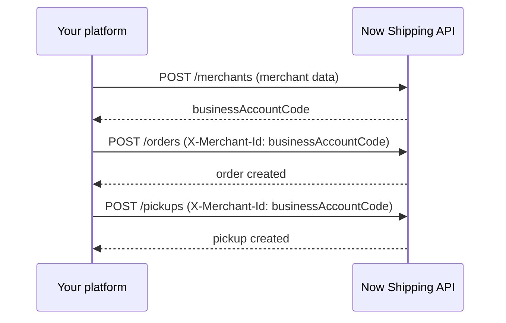

# Merchants API

Merchant onboarding for **company API keys** (multi-tenant integrators).

One API call creates a ready-to-ship Now Shipping merchant sub-account with a default pickup address. The returned `businessAccountCode` is immediately usable as `X-Merchant-Id` for orders and pickups.

## Prerequisites

1. Your account is marked as a **Company account** in Now Shipping admin.
2. You have a company API key (`nsk_live_...`).
3. Merchants created via API do **not** receive dashboard login credentials — your platform manages them through the API.
4. Call `GET /delivery-zones` first to populate your zone picker — `pickupAddress.zone` must be an exact catalog value.

## Onboard a merchant

`POST /api/public/v1/merchants`

### Request body

| Field | Type | Required | Description |
|-------|------|----------|-------------|
| `name` | string | yes | Merchant owner or business name |
| `email` | string | yes | Contact email (must be unique) |
| `phone` | string | yes | 11-digit Egyptian mobile number |
| `brandName` | string | yes | Public brand name |
| `externalMerchantId` | string | no | Your platform's shop ID (unique per company) |
| `pickupAddress` | object | yes | Default pickup address |
| `pickupAddress.city` | string | yes | Governorate: `Cairo`, `Giza`, or `Qalyubia` |
| `pickupAddress.zone` | string | yes | Exact zone `value` from `GET /delivery-zones` for the selected governorate |
| `pickupAddress.addressDetails` | string | yes | Street, building, floor |
| `pickupAddress.pickupPhone` | string | yes | 11-digit contact phone |
| `pickupAddress.nearbyLandmark` | string | no | Landmark for courier |
| `pickupAddress.country` | string | no | Defaults to `Egypt` |

### Example

```bash
curl -X POST "https://your-domain.com/api/public/v1/merchants" \
  -H "Authorization: Bearer nsk_live_YOUR_KEY" \
  -H "Content-Type: application/json" \
  -d '{
    "name": "Acme Store",
    "email": "owner@acme.com",
    "phone": "01000000000",
    "brandName": "Acme",
    "externalMerchantId": "shop_123",
    "pickupAddress": {
      "city": "Cairo",
      "zone": "Nasr City - ElHay 06 (Nasr City)",
      "addressDetails": "12 Street, Building 4",
      "pickupPhone": "01000000000",
      "nearbyLandmark": "Near City Center"
    }
  }'
```

### Success response (201)

```json
{
  "success": true,
  "data": {
    "message": "Merchant onboarded successfully.",
    "merchant": {
      "id": "66f1a2b3c4d5e6f7a8b9c0d1",
      "businessAccountCode": "48291736",
      "name": "Acme Store",
      "brandName": "Acme",
      "email": "owner@acme.com",
      "phoneNumber": "01000000000",
      "externalMerchantId": "shop_123",
      "isCompleted": true,
      "isVerified": true,
      "parentCompany": "66e0...",
      "createdAt": "2026-07-26T15:00:00.000Z"
    }
  }
}
```

Save `businessAccountCode` — use it (or your `externalMerchantId`) as `X-Merchant-Id` in all subsequent order and pickup requests.

## Create an order for the new merchant

```bash
curl -X POST "https://your-domain.com/api/public/v1/orders" \
  -H "Authorization: Bearer nsk_live_YOUR_KEY" \
  -H "X-Merchant-Id: 48291736" \
  -H "Content-Type: application/json" \
  -d '{
    "fullName": "Customer Name",
    "phoneNumber": "01098765432",
    "address": "15 Main St",
    "government": "Cairo",
    "zone": "Nasr City - ElHay 06 (Nasr City)",
    "orderType": "Deliver",
    "productDescription": "T-shirt",
    "numberOfItems": 1
  }'
```

## List merchants

`GET /api/public/v1/merchants`

Query: `page`, `limit`, `search` (name, email, phone, businessAccountCode, externalMerchantId, brandName)

## Get merchant

`GET /api/public/v1/merchants/{merchantId}`

`merchantId` accepts `businessAccountCode`, `externalMerchantId`, or MongoDB `_id`.

## Integration workflow



## Errors

| Status | Code | Cause |
|--------|------|-------|
| 400 | `VALIDATION_ERROR` | Missing or invalid fields |
| 403 | `FORBIDDEN` | API key is not a company account |
| 409 | `MERCHANT_ALREADY_EXISTS` | Duplicate email, phone, or externalMerchantId |

See [Errors](./errors.md) for full reference.
