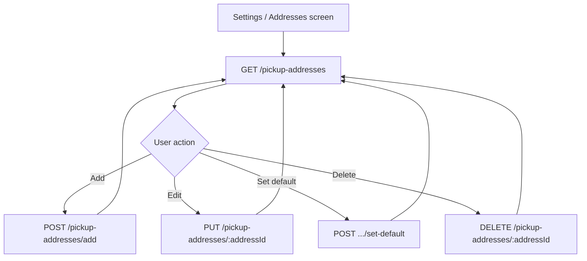

# Business pickup addresses — full Postman / mobile API guide

This document describes **every mobile endpoint** for managing a business’s **saved pickup addresses** (`pickUpAddresses` on the user profile). These are the locations couriers collect orders from — not pickup **requests** (`/get-pickups`, `/create-pickup`).

---

## 1. Before you start

### Base URLs

| Purpose | Base path |
|---------|-----------|
| **Business API** | `https://<your-host>/api/v1/business` |
| **Login (JWT)** | `https://<your-host>/api/v1/auth` |

### Headers (every business request)

| Header | Value |
|--------|--------|
| `Authorization` | `Bearer <jwt_token>` |
| `Content-Type` | `application/json` (POST/PUT bodies) |
| `Accept` | `application/json` |

### Get a JWT

**Request**

- **Method:** `POST`
- **URL:** `{{baseUrlAuth}}/login`
- **Body:**

```json
{
  "email": "shop@example.com",
  "password": "yourPassword"
}
```

**Success `200`** — copy `token` into Postman variable `accessToken`.

### Account completion

If `isCompleted` is `false`, most business routes return **`403`** with `Account not completed`. Pickup-address routes require a **completed** account (addresses can still be set during onboarding via `POST /complete-confirmation-form`).

---

## 2. Address object shape

Each entry in `pickUpAddresses`:

| Field | Type | Notes |
|-------|------|--------|
| `addressId` | string | Stable id (e.g. `addr_1739123456789_abc123`). Use in update/delete/set-default URLs. |
| `addressName` | string | Label shown in the app (e.g. "Main warehouse"). |
| `isDefault` | boolean | One address should be default; used when creating orders/pickups if none selected. |
| `country` | string | |
| `city` | string | |
| `zone` | string | Delivery zone name. |
| `adressDetails` | string | Street/building (legacy spelling kept in API). |
| `nearbyLandmark` | string | Optional. |
| `pickupPhone` | string | Defaults to account phone on add if omitted. |
| `otherPickupPhone` | string | Optional. |
| `pickUpPointInMaps` | string | Google Maps link or similar. |
| `coordinates` | object | `{ "lat": number, "lng": number }` or JSON string on add. |
| `createdAt` | string (ISO date) | Set by server. |

**City/zone pickers:** `GET /api/v1/business/delivery-zones` returns the catalog for forms.

---

## 3. Endpoints summary

| Action | Method | Path |
|--------|--------|------|
| List addresses | `GET` | `/api/v1/business/pickup-addresses` |
| List (full user) | `GET` | `/api/v1/business/user-data` |
| Add address | `POST` | `/api/v1/business/pickup-addresses/add` |
| Update address | `PUT` | `/api/v1/business/pickup-addresses/:addressId` |
| Delete address | `DELETE` | `/api/v1/business/pickup-addresses/:addressId` |
| Set default | `POST` | `/api/v1/business/pickup-addresses/:addressId/set-default` |

Web dashboard uses the same handlers under `/business/pickup-addresses/*`.

---

## 4. List pickup addresses

### `GET /pickup-addresses`

**Full URL:** `GET {{baseUrlBusiness}}/pickup-addresses`

**Success `200`**

```json
{
  "status": "success",
  "addresses": [
    {
      "addressId": "addr_1739123456789_abc123",
      "addressName": "Main Address",
      "isDefault": true,
      "country": "Egypt",
      "city": "Cairo",
      "zone": "Nasr City",
      "adressDetails": "12 Abbas El Akkad St",
      "nearbyLandmark": "Near City Stars",
      "pickupPhone": "+201012345678",
      "otherPickupPhone": "",
      "pickUpPointInMaps": "https://maps.google.com/?q=30.0444,31.2357",
      "coordinates": { "lat": 30.0444, "lng": 31.2357 },
      "createdAt": "2026-02-10T10:00:00.000Z"
    }
  ]
}
```

**Errors:** `401` unauthorized, `404` user not found, `500` server error.

### Alternative: `GET /user-data`

Returns the full user document; read `pickUpAddresses` from the root. Prefer `/pickup-addresses` for address-management screens.

---

## 5. Add pickup address

### `POST /pickup-addresses/add`

**Body (raw JSON)**

```json
{
  "addressName": "Warehouse",
  "country": "Egypt",
  "city": "Cairo",
  "zone": "Nasr City",
  "adressDetails": "12 Abbas El Akkad St, Building 3",
  "nearbyLandmark": "Near City Stars",
  "pickupPhone": "+201012345678",
  "otherPickupPhone": "",
  "pickUpPointInMaps": "https://maps.google.com/?q=30.0444,31.2357",
  "coordinates": { "lat": 30.0444, "lng": 31.2357 }
}
```

| Field | Required | Description |
|-------|----------|-------------|
| `country` | Yes | |
| `city` | Yes | |
| `zone` | Yes | |
| `adressDetails` | Yes | |
| `addressName` | No | Defaults to `Address N` or `Main Address` for first. |
| `pickupPhone` | No | Defaults to account `phoneNumber`. |
| `coordinates` | No | Object or JSON string. |

**Success `200`**

```json
{
  "status": "success",
  "message": "Pickup address added successfully",
  "address": {
    "addressId": "addr_1739123456789_xyz789",
    "addressName": "Warehouse",
    "isDefault": false,
    "country": "Egypt",
    "city": "Cairo",
    "zone": "Nasr City",
    "adressDetails": "12 Abbas El Akkad St, Building 3",
    "nearbyLandmark": "Near City Stars",
    "pickupPhone": "+201012345678",
    "otherPickupPhone": "",
    "pickUpPointInMaps": "https://maps.google.com/?q=30.0444,31.2357",
    "coordinates": { "lat": 30.0444, "lng": 31.2357 }
  }
}
```

**Notes**

- The **first** address is automatically `isDefault: true`.
- Store `address.addressId` for later update/delete/default.

**Errors:** `400` missing required fields, `404` user not found, `500` server error.

---

## 6. Update pickup address

### `PUT /pickup-addresses/:addressId`

**URL example:** `PUT /api/v1/business/pickup-addresses/addr_1739123456789_abc123`

Send **only fields to change** (partial update).

**Body example**

```json
{
  "addressName": "Main warehouse",
  "adressDetails": "12 Abbas El Akkad St, Floor 2",
  "nearbyLandmark": "Opposite mall entrance",
  "pickupPhone": "+201098765432",
  "coordinates": { "lat": 30.0444, "lng": 31.2357 }
}
```

**Success `200`**

```json
{
  "status": "success",
  "message": "Pickup address updated successfully",
  "address": { }
}
```

**Errors:** `404` user or address not found, `500` server error.

---

## 7. Set default pickup address

### `POST /pickup-addresses/:addressId/set-default`

**URL example:** `POST /api/v1/business/pickup-addresses/addr_1739123456789_abc123/set-default`

**Body:** none required.

**Success `200`**

```json
{
  "status": "success",
  "message": "Default pickup address updated successfully",
  "address": {
    "addressId": "addr_1739123456789_abc123",
    "isDefault": true
  }
}
```

All other addresses get `isDefault: false`.

**Errors:** `404` user or address not found, `500` server error.

---

## 8. Delete pickup address

### `DELETE /pickup-addresses/:addressId`

**URL example:** `DELETE /api/v1/business/pickup-addresses/addr_1739123456789_abc123`

**Success `200`**

```json
{
  "status": "success",
  "message": "Pickup address deleted successfully"
}
```

**Rules**

- Cannot delete the **only** remaining address (`400`: `Cannot delete the only pickup address`).
- If the deleted address was default, the **first** remaining address becomes default.

**Errors:** `400` only address, `404` not found, `500` server error.

---

## 9. Mobile app flow (recommended)



1. On screen open: `GET /pickup-addresses`.
2. Show default badge on `isDefault === true`.
3. After add/edit/delete/default: refresh list or merge response `address` into local state.
4. When creating orders or scheduling pickups, pass `pickupAddressId` / `selectedPickupAddressId` = chosen `addressId` (or omit to use default).

---

## 10. Postman collection

Import:

`docs/postman-business-pickup-addresses.postman_collection.json`

**Variables**

| Variable | Example |
|----------|---------|
| `baseUrl` | `http://localhost:3000` |
| `accessToken` | JWT from login |
| `addressId` | `addr_...` from list or add response |

**Suggested test order**

1. Business login → set `accessToken`
2. List pickup addresses
3. Add pickup address → set `addressId`
4. Update pickup address
5. Add second address → set-default on one of them
6. Delete non-default address (keep at least one)

---

## 11. Related endpoints (not address CRUD)

| Endpoint | Purpose |
|----------|---------|
| `POST /complete-confirmation-form` | Set initial `pickUpAddresses` during onboarding |
| `GET /delivery-zones` | City/zone catalog for forms |
| `POST /create-pickup` | Schedule a pickup **request** at a saved address |
| `GET /get-pickups` | List pickup **requests** |
