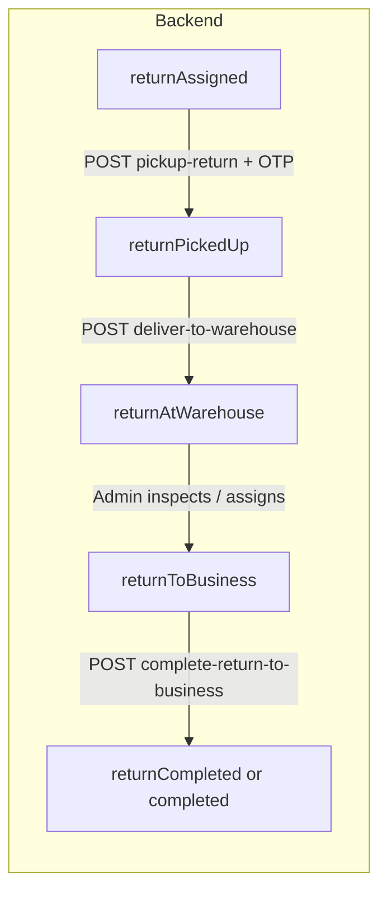

# Courier return process — full Postman / mobile API guide

This document describes **every courier-facing API** involved in the **return** journey after recent changes: **customer OTP at pickup**, **mobile-only** access (`/api/v1/courier`), and how the **Flutter (or other) app** should behave step by step.

---

## 1. Before you start (mobile app basics)

### Base URLs

| Purpose | Base path |
|---------|-----------|
| **Courier API (all operations below)** | `https://<your-host>/api/v1/courier` |
| **Login (JWT)** | `https://<your-host>/api/v1/auth` |

### Headers (use on every courier request)

| Header | Value |
|--------|--------|
| `Authorization` | `Bearer <your_jwt_token>` |
| `Content-Type` | `application/json` (for POST bodies) |
| `Accept` | `application/json` |

> **Important:** Several handlers check `Accept: application/json` for JSON responses. Always send **`Accept: application/json`** from the mobile app.

### Get a JWT (Postman: Auth folder)

**Request**

- **Method:** `POST`  
- **URL:** `{{baseUrlAuth}}/courier-login`  
  - Example: `https://host/api/v1/auth/courier-login`

**Body (raw JSON)**

```json
{
  "email": "courier@example.com",
  "password": "yourPassword"
}
```

**Success `200`**

```json
{
  "status": "success",
  "message": "Login successful",
  "token": "<jwt_string>",
  "user": {
    "id": "...",
    "name": "...",
    "email": "...",
    "role": "courier"
  }
}
```

Copy **`token`** into Postman environment variable `courierToken`, then set collection auth to **Bearer Token** = `{{courierToken}}`.

**Typical errors:** `400` validation / wrong credentials, `500` server error.

---

## 2. Return journey — what happens in the real world



1. **Business** requests a return; **admin** assigns **you** as the courier → order becomes **`returnAssigned`**.  
2. **Customer** receives a **6-digit OTP by SMS** (tied to the **original** order number in the message).  
3. You go to the customer, open the return in the app, enter the OTP, tap **confirm pickup** → **`returnPickedUp`**.  
4. You take the parcel to the warehouse → **deliver to warehouse** → **`returnAtWarehouse`**.  
5. **Admin** processes the return; when ready, status becomes **`returnToBusiness`** (you may get a push).  
6. You deliver to the business and tap **complete** → **`returnCompleted`** (or **`completed`** for an **Exchange** return leg).

Your app should **drive the UI from `order.orderStatus`** and the **`nextAction`** / **`currentStage`** strings returned by the list and detail APIs.

---

## 3. List return jobs assigned to you

### `GET /returns`

**Full URL:** `GET {{baseUrlCourier}}/returns`

**Query parameters**

| Name | Required | Description |
|------|----------|-------------|
| `status` | No | Filter by one status, or `all`. If omitted, the server uses this **`$in`** list: `returnAssigned`, `returnPickedUp`, `returnInspection`, `returnToWarehouse`, `returnToBusiness`. **`returnAtWarehouse` is not included** — after “deliver to warehouse”, the job may disappear from the default list until status changes again; use **`?status=returnAtWarehouse`** or **`?status=all`** if you need to show those rows in the app (or align product with a future API tweak). |
| `page` | No | Page number (default `1`). |
| `limit` | No | Page size (default `10`). |

**Example**

`GET /api/v1/courier/returns?status=returnAssigned&page=1&limit=20`

**Success `200`**

```json
{
  "orders": [
    {
      "orderNumber": "123456",
      "orderStatus": "returnAssigned",
      "orderShipping": {
        "orderType": "Return",
        "originalOrderNumber": "654321",
        "returnReason": "...",
        "isPartialReturn": false
      },
      "orderCustomer": { "fullName": "...", "phoneNumber": "...", "address": "..." },
      "progressPercentage": 22,
      "currentStage": "Assigned for Pickup",
      "nextAction": "Pick up from customer",
      "isPartialReturn": false,
      "partialReturnInfo": null
    }
  ],
  "pagination": {
    "currentPage": 1,
    "totalPages": 1,
    "totalCount": 3,
    "hasNext": false,
    "hasPrev": false
  }
}
```

**What the mobile app should do**

- Show a **Returns** tab with this list.  
- Sort/filter client-side if needed; server already returns newest first.  
- Tapping an item opens **detail** (next section).  
- Use **`orderStatus`** to show the right primary button:  
  - `returnAssigned` → “Pick up from customer” (needs OTP)  
  - `returnPickedUp` → “Deliver to warehouse”  
  - `returnToBusiness` → “Complete at business”  
  - Other statuses → read-only / “Waiting for warehouse or admin”

**Errors:** `401` missing/invalid token, `500` message in JSON.

---

## 4. Return order detail (OTP flags + timeline)

### `GET /returns/:orderNumber/details`

**Full URL:** `GET {{baseUrlCourier}}/returns/{{returnOrderNumber}}/details`

**Path**

- `orderNumber` = the **return** order’s `orderNumber` (from the list).

**Success `200`**

Top-level shape:

| Field | Type | Meaning |
|-------|------|---------|
| `order` | object | Full return order document (populated courier, business, linked deliver summary). |
| `progressPercentage` | number | Rough completion % from stages. |
| `stageTimeline` | array | Each return stage with `isCompleted`, `completedAt`, `notes`. |
| `currentStage` | string | Human label, e.g. `Assigned for Pickup`. |
| `nextAction` | string | Suggested next step, e.g. `Pick up from customer`. |
| `feeBreakdown` | object | If present on order. |
| **`returnOtpInfo`** | object or `null` | **Only when `order.orderStatus === 'returnAssigned'`**. Otherwise `null`. |

**When status is `returnAssigned`, `returnOtpInfo` looks like:**

```json
{
  "otpRequired": true,
  "otpIssuedAt": "2026-04-18T10:00:00.000Z",
  "otpExpiresAt": "2026-04-19T10:00:00.000Z",
  "otpVerified": false,
  "isLegacy": false
}
```

| Field | Meaning for the app |
|-------|---------------------|
| `otpRequired` | `true` → user **must** enter the 6-digit code from the customer’s SMS before calling **pickup-return**. |
| `otpIssuedAt` / `otpExpiresAt` | Show “OTP sent at … / valid until …” if you want trust UI. |
| `otpVerified` | After successful pickup, server sets verified; refresh detail if needed. |
| **`isLegacy`** | `true` when there is **no** stored OTP on file (old assignment). Server **allows pickup without OTP** but logs a warning. Still show optional OTP field off, or a note “Confirm with customer without code if instructed”. |

**Errors:** `401`, `404` (`Return order not found`), `500`.

**Mobile UX checklist**

1. Call this screen when the courier opens a return.  
2. If `order.orderStatus === 'returnAssigned'` and `returnOtpInfo?.otpRequired` → show **6-digit OTP** field + short copy: *“Ask the customer for the code they received by SMS for the original order.”*  
3. If `otpRequired` is `false` but `isLegacy` is `true` → hide OTP or show “No OTP on file — confirm pickup with supervisor if needed.”  
4. If OTP is expired (`otpExpiresAt` in the past, or API returns expired message) → show: *“OTP expired — ask operations to resend.”* (Resend is an **admin** action, not a courier API.)

---

## 5. Pick up from customer (**OTP required** when issued)

### `POST /orders/:orderNumber/pickup-return`

**Full URL:** `POST {{baseUrlCourier}}/orders/{{identifier}}/pickup-return`

**Path parameter `orderNumber` (flexible)**

The server accepts **any** of:

1. The **return** order’s `orderNumber`  
2. The **original deliver** order’s `orderNumber` (if it maps to your return)  
3. **Smart flyer barcode** of the original deliver order  

So scanning a barcode into this path often works.

**Body (raw JSON)**

```json
{
  "otp": "123456",
  "notes": "Optional courier notes",
  "pickupLocation": "Optional override address string",
  "pickupPhotos": [],
  "returnCondition": "optional",
  "returnValue": 0
}
```

| Field | Required | Description |
|-------|----------|-------------|
| **`otp`** | **Yes**, when `returnOtpInfo.otpRequired` was `true` | 6-digit string from customer SMS. |
| `otp` | No | When **legacy** (no OTP issued), omit or empty — pickup still allowed. |
| `notes`, `pickupLocation`, `pickupPhotos`, `returnCondition`, `returnValue` | No | Extra data for operations. |

**Success `200`**

The server returns the **updated return row** so the mobile app can switch the screen to **“Deliver to warehouse”** from this response alone (no extra `GET details` or list refresh required).

```json
{
  "success": true,
  "message": "Return picked up successfully",
  "orderNumber": "<return_order_number>",
  "orderStatus": "returnPickedUp",
  "currentStage": "Picked Up from Customer",
  "nextAction": "Deliver to warehouse",
  "progressPercentage": 38,
  "order": { "...": "same shape as GET /returns list item (otpHash stripped)" }
}
```

**Push (courier app):** an FCM **`courier_assignment`** is also sent with **`action`: `return_deliver_warehouse`** and data `orderStatus` / `nextAction`, so a background handler can update the UI without the courier tapping refresh.

**Socket (optional):** if the app uses Socket.IO, the server emits **`return-order-updated`** to room `courier:<courierId>` with `orderNumber`, `orderStatus`, `nextAction`, `currentStage`, `progressPercentage`.

After success, **`orderStatus`** becomes **`returnPickedUp`**.

**Error responses (typical)**

| HTTP | `message` (examples) |
|------|----------------------|
| `400` | `Return OTP is required to confirm pickup from customer.` |
| `400` | `Invalid OTP. Please ask the customer to check their SMS and try again.` |
| `400` | `Return OTP has expired. Ask the admin to resend it.` |
| `400` | `Order status <x> is not valid for return pickup Must be returnAssigned` |
| `404` | `Return order not found or not assigned to you.` |
| `401` | Not authenticated |
| `500` | `success: false`, `message` with error text |

**What the mobile app should do**

1. **Never** call this until status is **`returnAssigned`** (confirm with list or detail).  
2. If `otpRequired` → validate locally (6 digits) then POST with `otp`.  
3. On **invalid OTP** → keep the user on the same screen, show server `message`, allow retry (failed attempts are stored server-side).  
4. On **expired OTP** → disable submit; show message to contact admin / operations.  
5. On **success** → use the **`order`** / **`orderStatus`** / **`nextAction`** fields in the same response (or FCM **`return_deliver_warehouse`**) to show **Deliver to warehouse** immediately — no mandatory refetch.

---

## 6. Deliver return to warehouse

### `POST /orders/:orderNumber/deliver-to-warehouse`

**Full URL:** `POST {{baseUrlCourier}}/orders/{{orderNumber}}/deliver-to-warehouse`

**Path:** `orderNumber` or **smart flyer barcode** (same `$or` lookup as in code).

**Precondition:** `orderStatus` must be **`returnPickedUp`**.

**Body (optional)**

```json
{
  "notes": "Handed to warehouse desk",
  "warehouseLocation": "Main Warehouse",
  "conditionNotes": "Sealed",
  "deliveryPhotos": []
}
```

**Success `200`**

```json
{
  "message": "Return delivered to warehouse successfully",
  "order": { "...": "full order document" },
  "nextAction": "Wait for admin inspection and processing"
}
```

Status becomes **`returnAtWarehouse`**. The courier usually **waits** until admin moves the order to **`returnToBusiness`** (no courier API for that transition).

**Errors:** `400` wrong status, `404` not found / not yours, `401`, `500`.

**Mobile app:** After success, show **“Waiting for warehouse / admin”** and poll or push for status **`returnToBusiness`**.

---

## 7. Complete return at business

### `POST /orders/:orderNumber/complete-return-to-business`

**Full URL:** `POST {{baseUrlCourier}}/orders/{{orderNumber}}/complete-return-to-business`

**Precondition:** `orderStatus` must be **`returnToBusiness`**.

**Body (optional)**

```json
{
  "notes": "",
  "deliveryLocation": "",
  "businessSignature": null,
  "deliveryPhotos": []
}
```

**Success `200`**

```json
{
  "message": "Return completed successfully",
  "order": { "...": "updated order" },
  "completionDate": "2026-04-18T12:00:00.000Z"
}
```

- For normal **Return** orders, status becomes **`returnCompleted`**.  
- For **Exchange** type, completion may set **`completed`** (exchange leg finished); treat per `order.orderShipping.orderType` and `order.orderStatus` in the returned `order`.

**Errors:** `400` wrong status, `404`, `401`, `500`.

**Mobile app:** Only show this action when **`returnToBusiness`**. After success, remove from active list or show completed.

---

## 8. Regular orders API vs return API (avoid mistakes)

Completing a **normal delivery** or some exchange steps uses:

- `POST` or `PUT` **`/orders/:orderNumber/complete`** — **not** the same as return-to-business.

If the server responds with a message like *use the Returns flow*, the app should route the user to **return detail** and **`complete-return-to-business`** when status is **`returnToBusiness`**.

---

## 9. Postman collection structure (suggested folders)

| Folder | Requests |
|--------|----------|
| **0. Auth** | `POST /api/v1/auth/courier-login` |
| **1. Returns — read** | `GET /api/v1/courier/returns`, `GET /api/v1/courier/returns/{{returnOrderNumber}}/details` |
| **2. Returns — actions** | `POST .../pickup-return`, `POST .../deliver-to-warehouse`, `POST .../complete-return-to-business` |
| **3. (Optional) Orders** | `GET .../orders`, `GET .../orders/{{orderNumber}}/details`, `POST .../orders/{{orderNumber}}/complete` |

**Environment variables**

| Variable | Example |
|----------|---------|
| `host` | `https://api.example.com` |
| `baseUrlCourier` | `{{host}}/api/v1/courier` |
| `baseUrlAuth` | `{{host}}/api/v1/auth` |
| `courierToken` | paste JWT after login |

**Collection-level Authorization:** Type **Bearer Token**, Token `{{courierToken}}`.

---

## 10. Admin-only: OTP resend (not a courier endpoint)

If the customer did not receive the SMS or the OTP expired, **operations** uses:

- **`POST /admin/orders/:orderNumber/resend-return-otp`** (admin session, not Bearer courier JWT).

The mobile courier app should **not** call this; show a **“Contact support / operations”** message when the API returns OTP expired.

---

## 11. Quick troubleshooting for mobile developers

| Symptom | Check |
|---------|--------|
| Always `401` | `Authorization: Bearer <token>` and token from **`/api/v1/auth/courier-login`**. |
| HTML or `410` with `COURIER_WEB_DEPRECATED` | You are calling **`/courier/...`** web URLs. Use only **`/api/v1/courier/...`**. |
| `404` on pickup-return | Wrong `orderNumber`, not assigned to you, or status not `returnAssigned`. |
| OTP errors | Use detail endpoint first; ensure customer SMS matches **original** order reference. |
| Cannot complete at business | Status must be **`returnToBusiness`**; if stuck at **`returnAtWarehouse`**, admin has not released the next step yet. |

---

## Related docs

- [courier-mobile-api-pickup-complete.md](./courier-mobile-api-pickup-complete.md) — business pickup **complete** + auth recap.  
- [return-pickup-otp-api.md](./return-pickup-otp-api.md) — OTP field on order model + admin resend reference.
